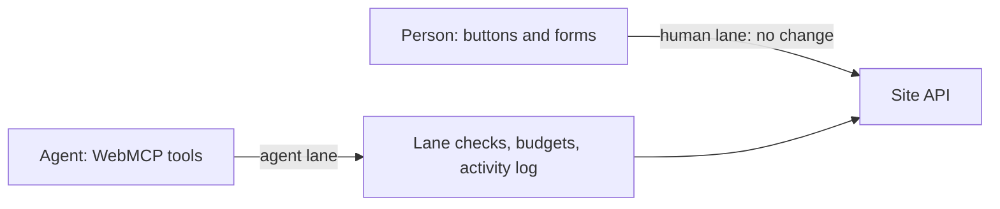

# WebMCP Dedicated Agent Lane

A dedicated agent lane gives agents a reason to use the [WebMCP](https://webmachinelearning.github.io/webmcp/) tools of a site, and not its page UI.
An agent that uses the tools goes through the agent lane, with known budgets and fewer blocks.
The site can then make bot protection stricter on the page UI and let valid tool requests skip it.
Site owners get visibility and predictable load, with little new code.

- **The carrot: the agent lane.** The agent gets a pass, published budgets and an activity log. RateLimit headers show the room left before a limit. With the optional [edge rules](docs/cloudflare.md#check-passes-at-the-edge), valid tool requests skip Super Bot Fight Mode, the Cloudflare bot protection.
- **The stick: the human lane.** On the page UI, the site can add stricter bot rules, challenges and human checks, for example before a consequential action. An agent that clicks through the UI meets them, and the site can refuse it.

For an agent, the lane is the predictable path and the UI is the hard path.
This project adds the agent lane. The site adds the checks on the human lane.

**Status:** Pre-1.0 reference implementation, with an adapter for Cloudflare Workers.

## Why

- **Sites cannot tell an agent from a person.** Agents click buttons and fill in forms, like a person.
- **Agents use the signed-in session of the person.** If the site blocks the agent, it can also block the person.
- **Agents can put load on endpoints.** Site owners want a budget for agent use.
- **Site owners cannot see what agents do.** Agent requests look like page requests in the logs.

## How it works



1. The page gets a pass from the site: a short-lived permission for a list of actions. The pass also lists the budgets, so the agent knows the limits before it starts. The session cookie of the person authenticates the pass request.
2. Each tool request goes to the normal site API with 2 lane headers: the pass reference and a signed proof for this action.
3. Optional: Cloudflare edge rules check the proof first. Tool requests with a valid proof skip Super Bot Fight Mode, the Cloudflare bot protection. Thus the site can make Super Bot Fight Mode stricter for the human lane, and valid tool requests still skip it.
4. The server checks the pass and applies the budgets. If a budget covers the action, the response has RateLimit headers. If a budget has no room, the response is HTTP 429.
5. The server records each tool request in an activity log.

For the wire format, the server checks and the error codes, see [SPEC.md](SPEC.md).

## Assumptions

1. **The agent can use WebMCP tools in the page**, for example through `document.modelContext`.
2. **The person is signed in on the site.** The agent never gets the password.
3. **The site owner controls the page and the server.** Control of the edge is optional.

## Quick start

These steps add the agent lane to a Cloudflare Worker. For more, see [docs/cloudflare.md](docs/cloudflare.md) and [examples/worker](examples/worker).

1. Install the package. The repository is private, so you need read access to it.
   ```sh
   npm install github:nekuda-ai/webmcp-agentlane
   ```

2. Add the Durable Object and the origin of your site to your `wrangler.jsonc`. If you already have migrations, add this one after the last one.
   ```jsonc
   {
     "compatibility_date": "2026-10-01", // 2024-04-03 or later.
     "vars": { "SITE_ORIGIN": "https://example.com" },
     "durable_objects": { "bindings": [{ "name": "AGENTLANE", "class_name": "AgentLaneStore" }] },
     "migrations": [{ "tag": "agentlane-v1", "new_sqlite_classes": ["AgentLaneStore"] }]
   }
   ```

3. Set a secret of 32 bytes or more. Use it only for the agent lane.
   ```sh
   openssl rand -hex 32 | npx wrangler secret put AGENTLANE_SECRET
   ```

4. Wrap your Worker with `withAgentLane`. Export the Durable Object class.
   ```js
   import { withAgentLane, AgentLaneStore } from '@nekuda/webmcp-agentlane/cloudflare';
   import site from './site.js'; // Your Worker: { fetch(request, env, ctx) }
   import { findSession } from './auth.js'; // Your sign-in check.

   export { AgentLaneStore };

   export default withAgentLane(site, {
     secret: (env) => env.AGENTLANE_SECRET,
     // Return an ID or a hash of the session, or null. Do not return the cookie value.
     session: async (request, env) => (await findSession(request, env))?.id ?? null,
     scope: ['GET /api/restaurants', 'POST /api/reservations'],
     budgets: [ // See docs/budgets.md for a starting set.
       { name: 'reads', actions: ['GET /api/restaurants'], limit: 20, windowSeconds: 30, per: 'pass' },
       { name: 'writes', actions: ['POST /api/reservations'], limit: 1, windowSeconds: 86400, per: 'session' },
       { name: 'session-ceiling', actions: '*', limit: 60, windowSeconds: 30, per: 'session' },
     ],
     allowedOrigin: (env) => env.SITE_ORIGIN, // The origin of your site, from "vars" in wrangler.jsonc.
   });
   ```

5. Add the tools to the page.
   ```js
   import { createAgentLaneClient, registerTools } from '@nekuda/webmcp-agentlane/browser';

   registerTools([{
     name: 'search_restaurants',
     description: 'Search restaurants by name, cuisine or area.',
     inputSchema: { type: 'object', properties: { query: { type: 'string' } } },
     annotations: { readOnlyHint: true },
     async execute({ query = '' }, { lane }) {
       const response = await lane.fetch(`/api/restaurants?q=${encodeURIComponent(query)}`);
       return response.json();
     },
   }], { client: createAgentLaneClient() });
   ```

6. Test the lane. Open the page and sign in. Ask your agent to search for a restaurant.
   Then open `/agentlane/activity` in the same browser. It shows the pass request and the tool request.

## Documentation

- [SPEC.md](SPEC.md): the specification of passes, lane headers, server checks, error codes and the activity log.
- [docs/budgets.md](docs/budgets.md): the budget model, a starting set and the RateLimit headers.
- [docs/cloudflare.md](docs/cloudflare.md): the Worker adapter, its options and the [optional edge rules](docs/cloudflare.md#check-passes-at-the-edge).
- [docs/security.md](docs/security.md): the threat model and the checks for [the human lane](docs/security.md#the-human-lane).
- [docs/api.md](docs/api.md): all functions, options and defaults.
- [examples/worker](examples/worker): a small notes site with 2 WebMCP tools. It runs on your computer.

Live example: [Table for Agents](https://tableforagents.com) is a test site for restaurant bookings that uses the agent lane.
Its human lane has more checks: the page buttons ask for a Turnstile check and a press-and-hold before a booking. Its agent lane has no such check.

## What the agent lane does not do

- **It does not prove identity.** For identity, see [PACT](https://decagon.ai/blog/introducing-the-personal-agent-consent-trust-protocol-pact) by Decagon and [Web Bot Auth](https://datatracker.ietf.org/doc/html/draft-ietf-webbotauth-httpsig-protocol-00).
- **It does not limit who can get a pass.** Any code in the signed-in page can get one, for example a bot, an automation script or a browser extension. The lane applies the same budgets to it and records its requests.
- **It does not stop agents that use the human lane.** To stop them, the site needs its own human check. See [The human lane](docs/security.md#the-human-lane).

The agent lane gives clear rules and visibility, not full protection. This is the trade-off for a simple implementation.

## License

MIT. See [LICENSE](LICENSE).
