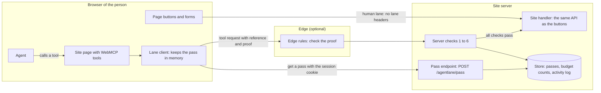
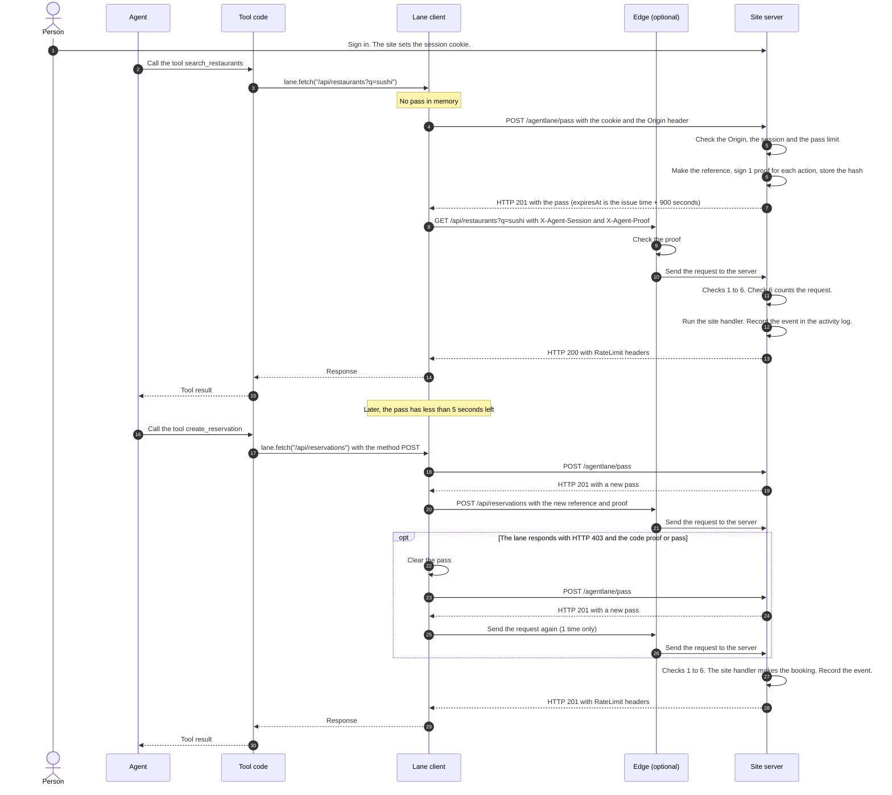
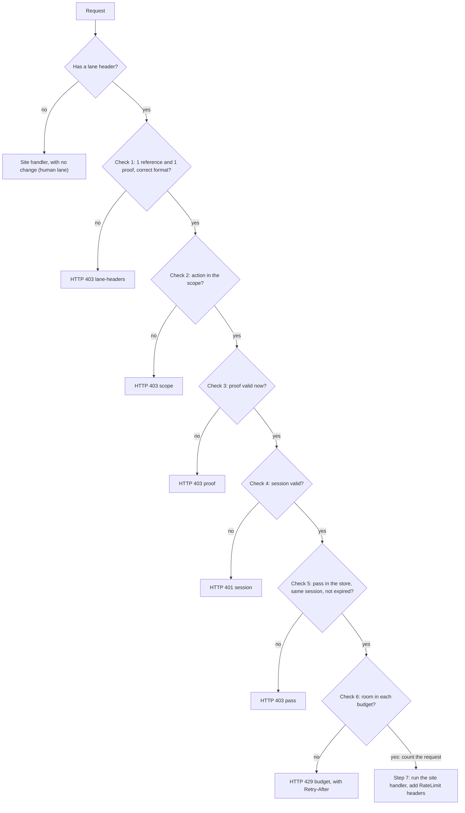

# Agent lane specification

This document specifies the agent lane: its wire format, the server checks, the budgets and the activity log.
If you write a client, a server adapter or edge rules, read this document.
For the other documents, see [README.md](README.md#documentation).

The terms come from the glossary in [docs/STYLE.md](docs/STYLE.md#glossary).

**Status:** Pre-1.0. The wire format can change before version 1.0.

## Overview

The agent lane uses 2 kinds of requests:

1. **The pass request.** The page asks the site for a pass. The session cookie of the person authenticates the request.
2. **The tool request.** The page sends a normal API request. It adds the reference and the proof in 2 headers.

The site signs all proofs when it issues the pass.
The page never gets the secret, and it does not sign anything.
The page buttons and forms use the human lane. Their requests have no lane headers.

Valid tool requests can skip Super Bot Fight Mode, the Cloudflare bot protection at the [edge](#edge-check).
If the [edge rules](docs/cloudflare.md#make-the-rules) have `origin`, the pass request can also skip it.
Thus the site can add stricter bot protection on the human lane without blocking the agent lane.
This gives agents a reason to use the tools.

This diagram shows the parts of the agent lane:



A tool call has these steps:

1. The person signs in on the site. The page registers its WebMCP tools.
2. The agent calls a tool. The lane client gets a pass from the pass endpoint, `POST /agentlane/pass`.
3. The site checks the `Origin` header and the session. Then it sends the pass: a reference, 1 proof for each action in the scope, and the budgets.
4. The lane client sends the tool request to the normal site API. It adds 2 lane headers: `X-Agent-Session` (the reference) and `X-Agent-Proof` (the proof for this action).
5. Optional: the edge checks the proof. A request with a valid proof skips Super Bot Fight Mode, the Cloudflare bot protection. A request with a bad proof gets HTTP 403.
6. The server does 6 checks in a fixed order. If all checks pass, the site handler gets the request.
7. If a budget covers the action, the server adds RateLimit headers to the response. It records an event in the activity log.

This diagram shows how the page gets a pass, uses it, and gets a new pass:



## Actions

An action is one HTTP method and one exact path.
The action key is the method in upper case, 1 space and the path:

```text
POST /api/reservations
```

- The action key has no query string and no fragment. `GET /api/restaurants?q=sushi` has the action key `GET /api/restaurants`.
- The lane does not support path patterns, because each action needs its own proof. `/api/items/1` and `/api/items/2` are 2 different actions.
- Put identifiers in the query string or in the body, not in the path.
- Use plain ASCII paths without percent-encoding. The edge and the server must see the same path.

## Reference

The reference is the random identifier of a pass.

- It has 32 random bytes from a cryptographic random source.
- Its text form has 64 lower-case hex characters. The pattern is `^[a-f0-9]{64}$`.
- The server stores only the SHA-256 hash of the reference. It never stores the reference itself.

## Proof

A proof is a signature that shows the site issued the pass for one action.
The site makes 1 proof for each action in the scope.

To make a proof, do these steps:

1. Get the current Unix time in seconds. It must have 10 digits.
2. Make the message: `${reference}:${METHOD}:${path}${unixSeconds}`. Do not put a separator between the path and the seconds.
3. Calculate the HMAC-SHA256 of the UTF-8 bytes of the message. Use the secret as the key.
4. Encode the MAC in standard base64, with `+`, `/` and `=`. The result has 44 characters.
5. Encode the base64 text with `encodeURIComponent`. Then `+` becomes `%2B`, `/` becomes `%2F` and `=` becomes `%3D`.
6. Join the seconds and the encoded MAC with a hyphen: `${unixSeconds}-${encodedMac}`.

The proof matches this pattern:

```text
^(\d{10})-((?:[A-Za-z0-9]|%2B|%2F){43}%3D)$
```

### Time

A proof is valid when `timestamp <= now` and `timestamp + ttl > now`.
The default time to live (TTL) is 900 seconds (15 minutes).
All proofs of a pass have the same timestamp: the issue time. Thus, all proofs expire together with the pass.
`expiresAt` in the pass is `(timestamp + ttl) * 1000`, in epoch milliseconds.

### What the proof covers

| The proof covers | The proof does not cover |
|---|---|
| The reference | The query string |
| The method | The request body |
| The path | The session of the person |
| The issue time | Other headers |

A proof is not single-use. The page can use the same proof for many requests to the same action until the pass expires.
The budgets limit the number of requests.
The server binds the pass to the session in check 5, not in the proof.

### Verification

The function `verifyProof()` verifies a proof with these steps:

1. Match the proof against the pattern.
2. Compare the timestamp with the current time and the TTL.
3. Decode the MAC. Accept only the canonical base64 form.
4. Verify the MAC with `crypto.subtle.verify`. This function compares in constant time.

The Worker adapter matches the pattern earlier, in check 1. If the proof does not match the pattern, the response has the code `lane-headers`.
For all other failure reasons, the response is HTTP 403 with the code `proof`.
The response does not tell the client which step failed.

### Test vector

Use this test vector to check a new implementation.

> [!CAUTION]
> The secret below is an example. Do not use it on a site.

| Input or output | Value |
|---|---|
| Secret | `example-secret-for-docs-only` |
| Reference | `0123456789abcdef0123456789abcdef0123456789abcdef0123456789abcdef` |
| Method and path | `POST /api/reservations` |
| Unix seconds | `1791360000` (2026-10-07 08:00:00 UTC) |
| Message | `0123456789abcdef0123456789abcdef0123456789abcdef0123456789abcdef:POST:/api/reservations1791360000` |
| MAC in base64 | `t0xu9Ru4kWlPNAFY+CfHdgSc8R7zYpWFeyMnrmUnEUk=` |
| Proof | `1791360000-t0xu9Ru4kWlPNAFY%2BCfHdgSc8R7zYpWFeyMnrmUnEUk%3D` |

To get the same MAC with OpenSSL, run this command:

```sh
printf '%s' '0123456789abcdef0123456789abcdef0123456789abcdef0123456789abcdef:POST:/api/reservations1791360000' \
  | openssl dgst -sha256 -hmac 'example-secret-for-docs-only' -binary | base64
```

## Lane headers

A tool request carries 2 lane headers:

| Header | Value | Default name |
|---|---|---|
| Reference header | The reference of the pass | `X-Agent-Session` |
| Proof header | The proof for the action of this request | `X-Agent-Proof` |

- Send exactly 1 reference header and 1 proof header in each tool request.
- The site can change the names. Use the same names in the server, the page and the edge rules.
- The name `X-Agent-Session` comes from tableforagents.com. Its value is the reference of the pass, not the session of the person.

## Pass request

The page sends the pass request from the same origin, with the normal session cookie of the person:

```http
POST /agentlane/pass HTTP/1.1
Host: example.com
Origin: https://example.com
Cookie: <the normal session cookie>
Content-Type: application/json

{}
```

- The default path is `/agentlane/pass`. The site can change it. tableforagents.com uses `/api/agent-session`.
- Do not send lane headers with the pass request. A request with lane headers goes to the lane checks, and check 2 rejects it.
- The server does not read the body.

The server checks the pass request in this order:

| Order | Check | Response if the check fails | `code` |
|---|---|---|---|
| 1 | The method is `POST`. | HTTP 405 with `Allow: POST` | `method` |
| 2 | The `Origin` header is the same as the site origin. | HTTP 403 | `origin` |
| 3 | The session of the person is valid. | HTTP 401 | `session` |
| 4 | The pass limit has room. The default is 5 passes in 30 seconds for each session. | HTTP 429 with `Retry-After` | `budget` |

If the secret or the store is not available, the response is HTTP 503 with the code `unavailable`.
The Worker adapter also responds with HTTP 503 if the secret has fewer than 32 bytes.

The server stores the hash of the reference, the session key and the expiry time.
The store keeps the 10 newest passes for each session.

## Pass response

If all checks pass, the server responds with HTTP 201 and `Cache-Control: no-store`.
The response also has RateLimit headers for the pass limit.

```json
{
  "reference": "0123456789abcdef0123456789abcdef0123456789abcdef0123456789abcdef",
  "expiresAt": 1791360900000,
  "scope": [
    "GET /api/restaurants",
    "GET /api/availability",
    "GET /api/reservations",
    "POST /api/reservations"
  ],
  "proofs": {
    "GET /api/restaurants": "1791360000-SE%2FG945DsR8yHCCr%2FQ7cR1%2FUTX8c768HRwWjh7qqS1w%3D",
    "GET /api/availability": "1791360000-2B%2BPrX4eigEMAbY%2B6FoBOz6UL37xZqZ%2Fqt2XGH5IhhI%3D",
    "GET /api/reservations": "1791360000-H3gvRPBfSrNF%2Bq8ZSyxe%2FzUPlmDUbHU5gHf463Z74dM%3D",
    "POST /api/reservations": "1791360000-t0xu9Ru4kWlPNAFY%2BCfHdgSc8R7zYpWFeyMnrmUnEUk%3D"
  },
  "budgets": [
    { "name": "reads", "actions": ["GET /api/restaurants", "GET /api/reservations"], "limit": 20, "windowSeconds": 30, "per": "pass" },
    { "name": "availability", "actions": ["GET /api/availability"], "limit": 5, "windowSeconds": 30, "per": "pass" },
    { "name": "writes", "actions": ["POST /api/reservations"], "limit": 1, "windowSeconds": 86400, "per": "session" },
    { "name": "session-ceiling", "actions": "*", "limit": 60, "windowSeconds": 30, "per": "session" }
  ]
}
```

The proofs in this example use the test vector secret and time.

| Field | Type | Meaning |
|---|---|---|
| `reference` | string | The reference of the pass: 64 lower-case hex characters. |
| `expiresAt` | number | The time when the pass expires, in epoch milliseconds. |
| `scope` | string array | The action keys that the pass permits. |
| `proofs` | object | 1 proof for each action key in `scope`. |
| `budgets` | object array | The budgets that apply to tool requests. See [Budgets](#budgets). |

## Tool request

The page sends the normal API request. It adds the lane headers and the session cookie:

```http
POST /api/reservations HTTP/1.1
Host: example.com
Origin: https://example.com
Cookie: <the normal session cookie>
Content-Type: application/json
X-Agent-Session: 0123456789abcdef0123456789abcdef0123456789abcdef0123456789abcdef
X-Agent-Proof: 1791360000-t0xu9Ru4kWlPNAFY%2BCfHdgSc8R7zYpWFeyMnrmUnEUk%3D

{"restaurantId":"bar-sera","date":"2026-10-09","time":"19:00","partySize":2}
```

## Server checks

The server checks each request that has a lane header. A request with only 1 of the 2 headers also goes to these checks.



| Order | Check | Response if the check fails | `code` |
|---|---|---|---|
| 1 | The request has 1 reference header and 1 proof header. The reference and the proof match their patterns. | HTTP 403 | `lane-headers` |
| 2 | The action of the request is in the scope. | HTTP 403 | `scope` |
| 3 | The proof is valid for this reference, this action and the current time. | HTTP 403 | `proof` |
| 4 | The site callback finds a valid session for the person. | HTTP 401 | `session` |
| 5 | The store has the pass. The pass belongs to this session and has not expired. | HTTP 403 | `pass` |
| 6 | Each budget that covers the action has room. The server counts the request. | HTTP 429 with `Retry-After` and RateLimit headers | `budget` |
| 7 | The server sends the request to the site handler. If a budget covers the action, it adds RateLimit headers to the response. | The status from the site handler | — |

The order has these reasons:

- Checks 1 to 3 need no storage and no session lookup. They stop bad requests at low cost.
- Check 2 comes before check 3. A request for an action outside the scope fails before any cryptography.
- Check 4 comes before check 5, because the store belongs to the session.
- Check 6 comes last. Thus, only requests that pass all other checks use the budget.

If a check cannot run, the response is HTTP 503 with the code `unavailable`. For example, the store does not respond.
If the site handler throws an error, the server records status 500 with the code `handler` in the activity log. Then it throws the error again.

These rules always apply:

- A request with lane headers never falls back to the human lane. It passes all checks, or it gets an error response.
- A request without lane headers goes to the site handler with no change.
- The lane checks do not replace the checks of the site. The site handler must still check the permissions of the person.

### Error responses

Each error response is JSON with `Cache-Control: no-store`:

```json
{ "error": "The pass does not permit this action.", "code": "scope" }
```

An HTTP 429 response has 2 more fields, `budget` and `retryAfter`. See [docs/budgets.md](docs/budgets.md#http-429).
For the rules on when the client sends a request again, see [Client rules](#client-rules).

| `code` | HTTP status | Meaning | What the client does |
|---|---|---|---|
| `lane-headers` | 403 | A lane header is not present, appears 2 times, or has a bad format. | Fix the client. |
| `scope` | 403 | The pass does not permit this action. | Do not send this action in the agent lane. |
| `proof` | 403 | The proof is not valid, or it has expired. | Get a new pass and send the request again 1 time. |
| `session` | 401 | The person is not signed in. | Ask the person to sign in. |
| `pass` | 403 | The store does not have the pass, or the pass belongs to another session, or it has expired. | Get a new pass and send the request again 1 time. |
| `budget` | 429 | A budget has no room. | Wait for the number of seconds in `Retry-After`. |
| `origin` | 403 | The pass request came from another origin. | Send the pass request from a page of the site. |
| `method` | 405 | The method is not correct for the pass endpoint or the activity endpoint. | Use the method in the `Allow` header. |
| `unavailable` | 503 | The server cannot do a check now. | Try again later. |

## Budgets

A budget is a limit on how many tool requests the agent lane accepts in a time window.
Each budget has a name, the actions that it covers, a limit, a window and a `per` value: `'pass'` or `'session'`.
The site sends its budgets in each pass, so the agent knows the limits before it starts.
The server counts a request in check 6, and only if each budget that covers the action has room.
If a budget has no room, the response is HTTP 429 with `Retry-After`. The site handler does not run.
If a budget covers the action, the lane adds RateLimit headers to the response of the site handler and to an HTTP 429 response.
The headers follow the style of the [IETF RateLimit header fields draft](https://datatracker.ietf.org/doc/draft-ietf-httpapi-ratelimit-headers/).
The pass request has its own limit. See [Pass request](#pass-request).

See [docs/budgets.md](docs/budgets.md) for the fields, a starting set, the windows, the headers and the HTTP 429 body.

## Activity log

The lane records 1 event for each tool request and each pass request.
The event holds enough data to see what agents do. It does not hold secrets or personal content.

| Recorded | Not recorded |
|---|---|
| The time (`at`, in epoch milliseconds) | The full reference |
| The lane (always `agent`) | The proofs |
| The action: method and path, without the query string | The session key and the cookies |
| The HTTP status of the response | The query string |
| The error code, for example `budget` or `handler`. It is `null` if the lane issues a pass or the site handler sends a response. | The request body and the response body |
| The first 8 characters of the reference (`pass`) | The IP address and the `User-Agent` header |

An event in the store looks like this:

```json
{ "at": 1791360012000, "lane": "agent", "action": "POST /api/reservations", "status": 201, "code": null, "pass": "01234567" }
```

- The Worker adapter keeps up to 200 events for each session. It removes the older events first. See [Store](docs/cloudflare.md#store).
- The `onAgentRequest` hook gets every event. This includes the events of requests that fail before the session check.
- By default, the hook writes 1 JSON line to the Worker log. See [Logs](docs/cloudflare.md#logs).
- If the edge blocks a request, the request does not reach the server. Cloudflare records it in its security events.

### Activity endpoint

The person can read the activity log of their own session:

```http
GET /agentlane/activity?limit=50 HTTP/1.1
Cookie: <the normal session cookie>
```

- The default path is `/agentlane/activity`. The site can change it.
- `limit` is optional. The default is 50, and the maximum is 200.
- Do not send lane headers with this request.

The response is HTTP 200 with the events of the session of the person, newest first:

```json
{
  "events": [
    { "at": 1791360012000, "lane": "agent", "action": "POST /api/reservations", "status": 201, "code": null, "pass": "01234567" },
    { "at": 1791360001000, "lane": "agent", "action": "POST /agentlane/pass", "status": 201, "code": null, "pass": "01234567" }
  ]
}
```

If the session is not valid, the response is HTTP 401 with the code `session`.

## Client rules

The lane client in `src/browser/agentlane.js` follows these rules. Follow them in other clients too.

1. Keep the pass in memory only. Do not put it in `localStorage`, `sessionStorage`, IndexedDB or a cookie.
2. Do not put the reference or a proof in a tool result. The agent does not need them.
3. Send only 1 pass request at a time. Other tool calls wait for the same pass.
4. Get a new pass when the current pass has less than 5 seconds left. The option `refreshMarginMs` sets this margin.
5. Measure the lifetime from the time when the client got the pass. Do not compare `expiresAt` with the clock of the page.
6. Find the proof with the method and the path, without the query string.
7. If the action is not in the scope, do not send the request. The lane client throws `Error('agentlane: action not in scope: ...')`.
8. Send tool requests only to the origin of the page.
9. Send each request with `credentials: 'same-origin'` and `cache: 'no-store'`. Do not follow redirects.
10. If a tool request gets HTTP 403 with the code `proof` or `pass`, clear the pass. Get a new pass and send the request again 1 time.
11. Do not send a tool request again after other responses. This includes HTTP 401 and HTTP 403 without the code `proof` or `pass`.
12. If a tool request gets HTTP 429, do not send it again immediately. Give the `Retry-After` value to the agent.

The clock of the page can be wrong, so rule 5 uses only the time differences that the client measures.
A redirect would send the lane headers to another URL, so rule 9 stops redirects.

Rules 10 and 11 read the `code` field of the response.
The lane sends the codes `proof` and `pass` before the site handler runs. Thus the request had no effect, and it is safe to send it again.
The site handler can send HTTP 401 or HTTP 403 after it does an action. Do not use the codes `proof` and `pass` in the site handler.

## Edge check

The edge check is optional. The edge can check a proof before the request gets to the server.
Cloudflare does this with the function `is_timed_hmac_valid_v0` in WAF custom rules.
A request with a valid proof skips Super Bot Fight Mode. A request with a lane header and no valid proof gets HTTP 403.
The rule expression builds this value from the request:

```text
concat(<reference header>, ":POST:", http.request.uri.path, "?verify=", <proof header>)
```

For the test vector, the value is:

```text
0123...cdef:POST:/api/reservations?verify=1791360000-t0xu9Ru4kWlPNAFY%2BCfHdgSc8R7zYpWFeyMnrmUnEUk%3D
```

The function call uses a separator length of 8, the length of `?verify=`.
The function removes the separator and calculates the HMAC of `0123...cdef:POST:/api/reservations1791360000`.
This is the same message as in the proof.
Cloudflare reads the MAC in URL-encoded base64. For this reason, the proof uses `encodeURIComponent`.

The edge checks the header count, the reference length, the method and path, the MAC and the time.
The edge does not check the session, the store or the budgets. The server still does all 6 checks.
See [docs/cloudflare.md](docs/cloudflare.md#check-passes-at-the-edge) for the rules, the setup steps and the risks of the secret in the rules.

## Compatibility with tableforagents.com

[Table for Agents](https://tableforagents.com) is the live example of the agent lane. nekuda.ai maintains it.
It is a test site for restaurant bookings. The restaurants are not real.
Its tools are `search_restaurants`, `check_availability`, `create_reservation`, `list_my_reservations`, `get_agent_policy` and `ask_site`.
It uses the same proof format and the same lane headers as this project.

| Item | This project | tableforagents.com |
|---|---|---|
| Pass endpoint | `POST /agentlane/pass` (the site can change it) | `POST /api/agent-session` |
| Lane headers | `X-Agent-Session`, `X-Agent-Proof` | The same |
| Proof format and message | As in this document | The same |
| TTL | 900 seconds | 900 seconds |
| Pass limit | 5 passes in 30 seconds for each session | 5 passes in 30 seconds for each account |
| Pass response | `reference`, `expiresAt`, `scope`, `proofs`, `budgets` | `reference`, `expiresAt`, `proofs`, `scopes` (names such as `restaurants:read`), `limits` |
| Error body | `{ error, code }` | `{ error }`, and `retryAfter` on HTTP 429 |
| Budgets | The lane checks them before the site handler. | The site handler checks them for each account. |

A client that uses only `reference`, `expiresAt` and `proofs` works with both.
tableforagents.com sends no `code` in an error response. Thus the lane client does not send a request again after an error from tableforagents.com.

## Related work

| Work | What it does | How it relates to the agent lane |
|---|---|---|
| [WebMCP](https://webmachinelearning.github.io/webmcp/) (W3C Web Machine Learning Community Group draft) | A page gives tools to agents through `document.modelContext`. | The agent lane controls the requests that these tools send. |
| [PACT](https://decagon.ai/blog/introducing-the-personal-agent-consent-trust-protocol-pact) (Decagon) | The Personal Agent Consent & Trust Protocol. It uses the Agent2Agent (A2A) protocol and OAuth 2.0. It verifies which person a personal agent acts for. It also verifies what the agent can do. | PACT gives identity and consent. The agent lane does not. |
| [Web Bot Auth](https://datatracker.ietf.org/doc/html/draft-ietf-webbotauth-httpsig-protocol-00) (IETF draft) | Automated clients sign HTTP requests with HTTP message signatures. | Web Bot Auth identifies the operator of a bot. The agent lane does not. |
| [RateLimit header fields](https://datatracker.ietf.org/doc/draft-ietf-httpapi-ratelimit-headers/) (IETF draft) | Standard HTTP fields that tell a client its quota. | The agent lane sends these fields for its budgets. |

The agent lane can work together with these protocols.
For example, a site can verify identity with PACT or Web Bot Auth. The same site can apply lane budgets to these requests.

[webmcp.com](https://webmcp.com) has a directory of sites with WebMCP tools, their tool schemas and a scanner.
