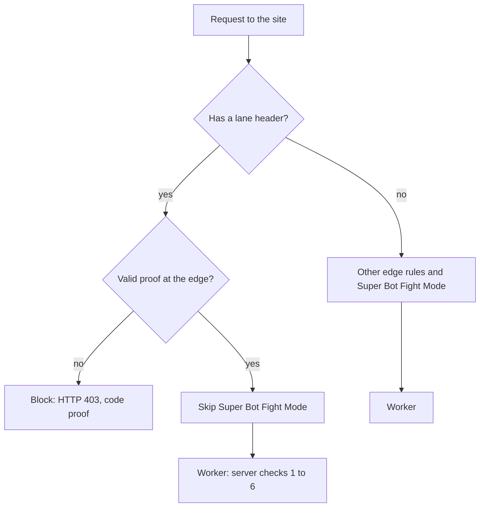

# Cloudflare

This document describes the Cloudflare adapter of the agent lane.
The Cloudflare adapter has 2 parts. The Worker adapter is necessary. The edge rules are optional.

## Parts

| Part | File | What it does |
|---|---|---|
| `withAgentLane(handler, options)` | `src/cloudflare/worker.js` | Wraps the Worker of the site. It responds to the pass request and the activity request. It checks each tool request. |
| `AgentLaneStore` | `src/cloudflare/store.js` | A Durable Object with SQLite storage, 1 object for each session. It keeps the passes, the budget counts and the activity log. |
| `wafRules(options)`, `orderedRules(rules)` | `src/cloudflare/waf.js` | Makes the Cloudflare WAF custom rules that check proofs at the edge. |
| `waf-rules.mjs` | `scripts/waf-rules.mjs` | A command that prints the edge rules as JSON. |

Import the adapter from `@nekuda/webmcp-agentlane/cloudflare`.
This module imports `cloudflare:workers`, so it runs only in a Worker.
To make the edge rules in Node.js, use the command `scripts/waf-rules.mjs`.
You can also import `wafRules` from `@nekuda/webmcp-agentlane/cloudflare/waf`.
[api.md](api.md) lists all exports.

## Requirements

- Cloudflare Workers with Durable Objects and SQLite storage.
- A `compatibility_date` of `2024-04-03` or later. The adapter uses Durable Object RPC.
- For the edge rules: a Cloudflare Pro, Business or Enterprise plan. The function `is_timed_hmac_valid_v0` and Super Bot Fight Mode need one of these plans.
- Node.js 22 for the tests and for the command.

## Set up the Worker

### 1. Install the package

The repository is private, so you need read access to it.

```sh
npm install github:nekuda-ai/webmcp-agentlane
```

### 2. Add the Durable Object

Add the binding, a migration and the origin of your site to your Wrangler configuration.
If you already have migrations, add a new tag after the last one.

```toml
compatibility_date = "2026-10-01"

[vars]
SITE_ORIGIN = "https://example.com"

[[durable_objects.bindings]]
name = "AGENTLANE"
class_name = "AgentLaneStore"

[[migrations]]
tag = "agentlane-v1"
new_sqlite_classes = ["AgentLaneStore"]
```

The same configuration in `wrangler.jsonc`:

```jsonc
{
  "compatibility_date": "2026-10-01",
  "vars": { "SITE_ORIGIN": "https://example.com" },
  "durable_objects": {
    "bindings": [{ "name": "AGENTLANE", "class_name": "AgentLaneStore" }]
  },
  "migrations": [{ "tag": "agentlane-v1", "new_sqlite_classes": ["AgentLaneStore"] }]
}
```

### 3. Set the secret

Make a random secret and give it to the Worker. Use this secret only for the agent lane.
The secret must have 32 bytes or more. If it is shorter, the Worker responds to lane requests with HTTP 503.

```sh
openssl rand -hex 32 | npx wrangler secret put AGENTLANE_SECRET
```

For local development, put a different secret in `.dev.vars`. Do not commit `.dev.vars`.

```sh
printf 'AGENTLANE_SECRET=%s\nSITE_ORIGIN=http://localhost:8787\n' "$(openssl rand -hex 32)" >> .dev.vars
```

If you plan to use the edge rules, read [Check passes at the edge](#check-passes-at-the-edge) first.
The edge rules need the same secret as the Worker. Wrangler cannot show a secret after you set it.

### 4. Wrap the Worker

Wrap the handler of your site with `withAgentLane`. Export the Durable Object class from the same module.

```js
import { withAgentLane, AgentLaneStore } from '@nekuda/webmcp-agentlane/cloudflare';
import site from './site.js'; // Your Worker: { fetch(request, env, ctx) }
import { findSession } from './auth.js'; // Your sign-in check.

export { AgentLaneStore };

export default withAgentLane(site, {
  secret: (env) => env.AGENTLANE_SECRET,
  session: async (request, env) => (await findSession(request, env))?.id ?? null,
  scope: [
    'GET /api/restaurants',
    'GET /api/availability',
    'GET /api/reservations',
    'POST /api/reservations',
  ],
  budgets: [
    { name: 'reads', actions: ['GET /api/restaurants', 'GET /api/reservations'], limit: 20, windowSeconds: 30, per: 'pass' },
    { name: 'availability', actions: ['GET /api/availability'], limit: 5, windowSeconds: 30, per: 'pass' },
    { name: 'writes', actions: ['POST /api/reservations'], limit: 1, windowSeconds: 86400, per: 'session' },
    { name: 'session-ceiling', actions: '*', limit: 60, windowSeconds: 30, per: 'session' },
  ],
  allowedOrigin: (env) => env.SITE_ORIGIN, // For example "https://example.com".
});
```

The site handler gets the original request. The adapter does not read the request body.

Write the `session` callback with these rules:

- Return a stable key for the session of the person. If the person is not signed in, return `null`.
- Return an ID or a hash. Do not return the cookie value. The store keeps the key, and the key names the Durable Object.
- Do not read the request body. The site handler needs the body later.
- Keep the callback fast. The adapter calls it for each tool request, each pass request and each activity request.

The key decides the meaning of "session" for budgets and for the activity log.
See [budgets.md](budgets.md#per-pass-and-per-session).

### 5. Add the tools to the page

Use `createAgentLaneClient` and `registerTools` from `@nekuda/webmcp-agentlane/browser`.
The tools call the same API as the page buttons.

```js
import { createAgentLaneClient, registerTools } from '@nekuda/webmcp-agentlane/browser';

const lane = createAgentLaneClient();

registerTools(
  [
    {
      name: 'search_restaurants',
      description: 'Search restaurants by name, cuisine or area.',
      inputSchema: {
        type: 'object',
        properties: { query: { type: 'string', description: 'The words to search for.' } },
      },
      annotations: { readOnlyHint: true },
      async execute({ query = '' }, { lane }) {
        const response = await lane.fetch(`/api/restaurants?q=${encodeURIComponent(query)}`);
        return response.json();
      },
    },
    {
      name: 'create_reservation',
      description: 'Book a table. Use this tool only after the person confirms the booking.',
      inputSchema: {
        type: 'object',
        properties: {
          restaurantId: { type: 'string' },
          date: { type: 'string', description: 'YYYY-MM-DD' },
          time: { type: 'string', description: 'HH:MM' },
          partySize: { type: 'integer', minimum: 1 },
        },
        required: ['restaurantId', 'date', 'time', 'partySize'],
      },
      async execute(input, { lane }) {
        const response = await lane.fetch('/api/reservations', {
          method: 'POST',
          headers: { 'Content-Type': 'application/json' },
          body: JSON.stringify(input),
        });
        return response.json();
      },
    },
  ],
  { client: lane },
);
```

- If the browser has no WebMCP support, `registerTools` returns `false`.
- The lane client keeps the pass in memory only. It gets a new pass before the old pass expires.
- If you do not use a bundler, serve `src/browser/agentlane.js` from your site. Then import it from that path.

The folder [examples/worker](../examples/worker) has a full Worker and page that run on your computer.
It is a small notes site with 2 WebMCP tools.

### 6. Test the Worker

Start the Worker on your computer:

```sh
npx wrangler dev
```

Then send 2 bad requests. Each request must get an error response.

```sh
# A lane header without a proof. Expect HTTP 403 with the code "lane-headers".
curl -i http://localhost:8787/api/restaurants -H 'X-Agent-Session: 0'

# A pass request from another origin. Expect HTTP 403 with the code "origin".
curl -i -X POST http://localhost:8787/agentlane/pass \
  -H 'Origin: https://other.example' -H 'Content-Type: application/json' -d '{}'
```

Then open the page. Sign in. Ask your agent to search for a restaurant.
Then open `/agentlane/activity` in the same browser. You see the pass request and the tool request.
To run the unit tests of this repository, run `npm test`.

## Options

| Option | Default | Meaning |
|---|---|---|
| `secret` | Required | `(env) => string`. Returns the signing secret, for example `env.AGENTLANE_SECRET`. The secret must have 32 bytes or more. |
| `session` | Required | `async (request, env) => sessionKey or null`. Returns the key of the signed-in session. |
| `scope` | Required | The action keys that a pass permits. The pass request must not be in the scope. |
| `budgets` | `[]` | The budgets. See [budgets.md](budgets.md). |
| `passPath` | `'/agentlane/pass'` | The path of the pass request. |
| `activityPath` | `'/agentlane/activity'` | The path of the activity request. |
| `ttlSeconds` | `900` | The lifetime of a pass and its proofs, from 1 to 86400 seconds. Use the same value in the edge rules. |
| `headers` | `{ reference: 'X-Agent-Session', proof: 'X-Agent-Proof' }` | The names of the lane headers. Use the same names in the page and in the edge rules. |
| `store` | The Durable Object binding `env.AGENTLANE`, 1 object for each session key | `(env, sessionKey) => store`. Returns the store of a session. See [Store](#store). |
| `allowedOrigin` | The origin of the request URL | `(env) => origin`. The pass request must come from this origin. Set it. |
| `passLimit` | `{ limit: 5, windowSeconds: 30 }` | The limit on pass requests for each session. `null` removes the limit. |
| `onAgentRequest` | Writes `logLine(event)` to `console.log` | `(event) => void`. Gets each activity event. |
| `now` | `Date.now` | Returns the time in epoch milliseconds. Use it only in tests. |

If an option is not valid, `withAgentLane` throws a `TypeError` when the Worker starts.

## Endpoints

The adapter responds to these paths. Do not use them for other things on your site.

| Method and path | Caller | Response |
|---|---|---|
| `POST /agentlane/pass` | The lane client in the page | HTTP 201 with a pass. See [SPEC.md](../SPEC.md#pass-request). |
| `GET /agentlane/activity` | The page, for the person | HTTP 200 with the events of the session. See [SPEC.md](../SPEC.md#activity-endpoint). |

## Logs

The adapter sends each activity event to the `onAgentRequest` hook.
By default, the hook writes 1 JSON line to the Worker log:

```json
{"type":"agentlane.activity","at":1791360012000,"lane":"agent","action":"POST /api/reservations","status":201,"code":null,"pass":"01234567"}
```

- To send the events to your log system, set `onAgentRequest`.
- If the hook returns a promise, the adapter keeps the Worker alive with `ctx.waitUntil` until the promise settles.
- If the hook throws an error, the response to the request does not change.
- The hook gets every event. The store gets only the events after the adapter knows the session.

## Store

The default store is the Durable Object `AgentLaneStore`. The adapter uses 1 object for each session key.
Each object has 3 SQLite tables:

| Table | Content | Limit |
|---|---|---|
| `passes` | The hash of each reference, the session key and the expiry time | The 10 newest passes for each session |
| `uses` | 1 row for each counted tool request | The store removes rows that are older than 1 day |
| `activity` | The activity log, with a SHA-256 hash of the session key | The 200 newest events for each session |

The store removes expired passes and old uses at each pass request.

The store checks a budget and counts the request in 1 step.
Thus 2 tool requests at the same time cannot both use the last room in a budget.

To use another store, set the option `store`. The store must have these async methods:

```js
putPass({ referenceHash, sessionKey, expiresAt })
getPass(referenceHash)            // -> { sessionKey, expiresAt } or null
countUses(key, sinceMs)           // -> number of uses after sinceMs
addUse(key, atMs)
addUsesIfRoom(entries, atMs)      // optional: check and count in 1 step. See api.md.
prune(nowMs)
logActivity(event, { sessionKey })
listActivity({ sessionKey, limit }) // -> the events of that session, newest first
```

A store can hold the data of many sessions. Then it must keep the sessions apart:

- `listActivity` returns only the events that `logActivity` got with the same `sessionKey`.
- The store limits the number of passes for each session, not for all sessions together.

Add `addUsesIfRoom` to your store. Without it, requests at the same time can go over a budget by a small number.
`MemoryStore` in `src/core/memory-store.js` has the same methods. Use it for tests and local development only.
`MemoryStore` and `AgentLaneStore` follow the rules above.

## Check passes at the edge

This part is optional. It needs a Cloudflare Pro, Business or Enterprise plan.

### Why

Super Bot Fight Mode is a Cloudflare bot protection feature. It can block agents, because agent traffic looks like automation.
A skip rule for every request with a lane header is not safe. Any bot can add a header.

The edge rules check the proof at the edge first. Only a request with a valid proof skips Super Bot Fight Mode.
A request with a lane header and a bad proof gets HTTP 403 at the edge. It does not reach the Worker.

Because valid tool requests skip Super Bot Fight Mode, you can make it stricter and not block them.
Then an agent that clicks through the page UI can meet more bot challenges. That is an incentive for agents to use the WebMCP tools.

If you make it stricter, set `origin` so that the pass request also skips it (see [Make the rules](#make-the-rules)).
Other requests do not skip it, for example the page load, the sign-in and the activity request.
See also [The human lane](security.md#the-human-lane).



### What the rules do

`wafRules()` makes these rules. The command prints them in this order.

| Rule description | Action | Requests that match |
|---|---|---|
| `Agent lane - reject invalid agent writes` | Block with HTTP 403 | Not `GET`, a lane header, and no valid proof |
| `Agent lane - reject invalid agent reads` | Block with HTTP 403 | `GET`, a lane header, and no valid proof |
| `Agent lane - signed agent GET requests` | Skip Super Bot Fight Mode | `GET` with a valid proof for an action in the scope |
| `Agent lane - signed agent POST requests` | Skip Super Bot Fight Mode | `POST` with a valid proof. There is 1 rule for each write method in the scope. |
| `Agent lane - pass request` | Skip Super Bot Fight Mode | `POST` to the pass path with the site `Origin`. Only if you set `origin`. |

A valid proof at the edge has all these properties:

- The request has exactly 1 reference header and 1 proof header.
- The reference has 64 characters.
- The method and the path are in the scope.
- `is_timed_hmac_valid_v0` accepts the proof for this reference, method, path and time.

The edge does not check the session, the store or the budgets. The Worker still does all 6 checks.

The rules match the live rules of tableforagents.com. This is the expression of the first rule, with line breaks for clarity:

```text
http.host eq "example.com"
and (has_key(http.request.headers, "x-agent-session") or has_key(http.request.headers, "x-agent-proof"))
and http.request.method ne "GET"
and not (
  coalesce(len(http.request.headers["x-agent-session"]), 0) eq 1
  and coalesce(len(http.request.headers["x-agent-proof"]), 0) eq 1
  and len(coalesce(http.request.headers["x-agent-session"][0], "")) eq 64
  and http.request.method eq "POST"
  and http.request.uri.path eq "/api/reservations"
  and is_timed_hmac_valid_v0("<AGENTLANE_SECRET>",
        concat(coalesce(http.request.headers["x-agent-session"][0], ""), ":POST:",
               http.request.uri.path, "?verify=", coalesce(http.request.headers["x-agent-proof"][0], "")),
        900, http.request.timestamp.sec, 8)
)
```

> [!CAUTION]
> The secret is in plain text inside the rule expressions.
> Anyone who can read the edge rules of the site in Cloudflare can read the secret.
> Use a secret only for the agent lane. Rotate the secret on a schedule. See [security.md](security.md#the-secret).

### Make the rules

Write a config file, for example `agentlane.waf.json`. Do not put the secret in this file.

```json
{
  "host": "example.com",
  "scope": ["GET /api/restaurants", "GET /api/availability", "GET /api/reservations", "POST /api/reservations"],
  "ttlSeconds": 900,
  "headers": { "reference": "X-Agent-Session", "proof": "X-Agent-Proof" },
  "origin": "https://example.com",
  "passPath": "/agentlane/pass"
}
```

The file `examples/worker/agentlane.waf.json` is a config file for the notes example.

- You must set `host` and `scope`. Use the same scope as the Worker.
- `ttlSeconds` and `headers` are optional. Use the same values as the Worker.
- `origin` and `passPath` are optional. If you set `origin`, the command also prints the pass request rule.

The command reads the secret from the environment variable `AGENTLANE_SECRET`.
Use a secret with 32 characters or more. If the secret is shorter, the command writes a warning.
The Worker refuses a secret with fewer than 32 bytes.
The secret can have only printable ASCII characters, without spaces, double quotes or backslashes.
`openssl rand -hex 32` makes a secret with 64 hex characters.

The rules need the same secret as the Worker. Wrangler cannot show a secret after you set it.
Thus, make a new secret and give it to the Worker and to the rules at the same time:

```sh
# Make a new secret. It stays in this shell only.
export AGENTLANE_SECRET="$(openssl rand -hex 32)"

# Give the secret to the Worker.
printf '%s' "$AGENTLANE_SECRET" | npx wrangler secret put AGENTLANE_SECRET

# Check the rules. The command writes a summary to stderr.
node node_modules/@nekuda/webmcp-agentlane/scripts/waf-rules.mjs agentlane.waf.json --lines > /dev/null
```

> [!CAUTION]
> The output of the command contains the secret.
> Do not save the output in a file, in the repository or in a ticket.

### Add the rules to the zone

In Cloudflare, a zone is 1 domain and its settings. The edge rules are WAF custom rules of the zone.

Use an API token that can edit only the WAF custom rules of this zone.
Anyone with this token can read the rules, and thus the secret. Keep the token as safe as the secret.
These commands need bash, curl 7.55 or later, and `jq`.

```sh
ZONE_ID="<zone id>"
API="https://api.cloudflare.com/client/v4/zones/$ZONE_ID/rulesets"

# Print the Authorization header. printf is a shell builtin, so the token
# is not in the process list. curl reads the header with -H @<(auth).
auth() { printf 'Authorization: Bearer %s\n' "$CLOUDFLARE_API_TOKEN"; }

# Find the ruleset of the custom rules phase.
RULESET_ID="$(curl -sS "$API/phases/http_request_firewall_custom/entrypoint" -H @<(auth) | jq -r .result.id)"

# Add each rule at the end of the ruleset, in the order of the output.
node node_modules/@nekuda/webmcp-agentlane/scripts/waf-rules.mjs agentlane.waf.json --lines |
while IFS= read -r rule; do
  printf '%s' "$rule" | curl -sS -X POST "$API/$RULESET_ID/rules" -H @<(auth) \
    -H 'Content-Type: application/json' --data @- | jq -r '.success'
done

unset AGENTLANE_SECRET
```

The commands send each rule on standard input. curl reads the token from a file descriptor.
Thus the secret and the token are not in the process list.

If the zone has no custom rules, the entrypoint ruleset does not exist yet.
In this case, make the ruleset with `PUT $API/phases/http_request_firewall_custom/entrypoint` and a body `{"rules": [...]}`.
Do not use this `PUT` on a zone that has custom rules. It replaces all rules.

You can also paste each expression into the custom rules of the zone in the Cloudflare dashboard.

Check these points after you add the rules:

- The block rules come before the skip rules.
- No earlier rule skips the remaining custom rules for the paths in the scope. If one does, the block rules do not run.
- A tool call from the page still works. A request with a bad proof gets HTTP 403 from the edge.

### Keep the rules and the Worker the same

- Use the same scope, `ttlSeconds` and header names in the rules and in the Worker.
- If you change the scope, make the rules again. If you do not have the secret, rotate it.
- Cloudflare accepts rule expressions of 4096 characters or fewer. If a rule is too long, the command stops with an error. Use fewer paths in the scope.

### Rotate the secret

Rotate the secret on a schedule, for example every 90 days.
Rotate it immediately if you think that someone else has it.
Rotate it when a person with access to the zone leaves the team.

Do these steps:

1. Delete the agent lane rules from the zone. The Worker still does all checks.

   ```sh
   curl -sS "$API/phases/http_request_firewall_custom/entrypoint" -H @<(auth) \
     | jq -r '.result.rules[] | select(.description | startswith("Agent lane - ")) | .id' |
   while IFS= read -r id; do
     curl -sS -X DELETE "$API/$RULESET_ID/rules/$id" -H @<(auth) > /dev/null
   done
   ```

2. Make a new secret and give it to the Worker. Use the commands in [Make the rules](#make-the-rules).
3. Add the new rules. Use the commands in [Add the rules to the zone](#add-the-rules-to-the-zone).

These are the effects of a rotation:

- All passes from before step 2 stop working. The lane client gets HTTP 403, gets a new pass and sends the request again.
- Between step 1 and step 3, tool requests do not skip Super Bot Fight Mode. Some agents can get a challenge.
- If you use the Worker without edge rules, do only step 2.

## Problems and solutions

With edge rules, the edge blocks some requests before the Worker can check them.
Then bad lane headers and actions outside the scope get HTTP 403 with the code `proof` from the edge.
The rows for `lane-headers` and `scope` apply to a site without edge rules.

| Problem | Possible cause | What to do |
|---|---|---|
| HTTP 403 with the code `proof`, and the Worker log has no event | The edge rules use a different secret, TTL or scope from the Worker. The edge message starts with "The pass reference or proof". | Make the rules again with the values of the Worker. |
| Tool requests get bot challenges at the edge | The edge rules use different header names from the Worker. Then the tool requests do not match the skip rules. | Make the rules again with the header names of the Worker. |
| HTTP 403 with the code `lane-headers` | The client sends only 1 lane header, or sends a header 2 times. | Send 1 reference header and 1 proof header. |
| HTTP 403 with the code `scope` | The action is not in the scope. The path has an identifier or a different trailing slash. | Add the exact action to the scope. Move identifiers to the query string or the body. |
| HTTP 403 with the code `origin` on the pass request | The `Origin` header is not the same as `allowedOrigin`. | Set `SITE_ORIGIN` to the origin of the page. For local development, use `.dev.vars`. |
| HTTP 401 with the code `session` | The `session` callback returns `null`, or the request has no session cookie. | Sign in. Check that the client sends `credentials: 'same-origin'`. |
| HTTP 403 with the code `pass` | The pass belongs to another session, or the store does not have it. | Get a new pass. The lane client does this automatically, 1 time. |
| HTTP 429 with the code `budget` | A budget has no room. | Wait for `Retry-After` seconds. To change the budget, see [budgets.md](budgets.md). |
| HTTP 503 with the code `unavailable` | The secret is not set or has fewer than 32 bytes, the binding `AGENTLANE` is not there, or the store failed. | Read the Worker log. Each error line from the adapter starts with `agentlane:`. |
| `TypeError` when the Worker starts | An option or a budget is not valid. | Read the error message. It names the option. |
