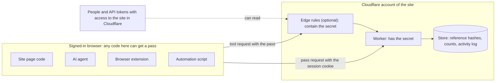

# Security

This document describes the threat model of the agent lane.
It tells what the lane does, what it does not do, and how to use it safely.
Read it before you add the lane to a site.

## Summary

The agent lane is a small control. It is not an identity system.

The lane does 3 things:

- It separates tool requests from page requests.
- It binds each pass to the session of the person.
- It limits tool requests with budgets.

The lane does not prove who sends a request. Any code that runs in the signed-in page can use the lane.

## What the lane does

| Property | How the lane gets it |
|---|---|
| Only the site can issue a pass. | The site signs each proof with a secret. The page never gets the secret. |
| A pass permits only the actions in its scope. | Each action has its own proof. Check 2 and check 3 reject other actions. |
| A pass works only in the session that got it. | The store binds the hash of the reference to the session key. Check 5 compares them. |
| A pass expires. The default lifetime is 15 minutes. | All proofs carry the issue time. Check 3 and check 5 reject an old pass. |
| Tool requests stay inside the budgets. | Check 6 counts each request before the site handler runs. |
| A failed tool request never reaches the site handler. | A request with lane headers never falls back to the human lane. |
| The site owner can see what agents do. | The lane records each tool request and each pass request. |
| The logs do not show the full reference of a pass. | The activity log keeps only the first 8 characters of the reference. |

## What the lane does not do

- **It does not prove identity.** A lane header tells the site which lane a request uses. It does not prove that an AI agent sent the request, or which agent. For identity, see [PACT](https://decagon.ai/blog/introducing-the-personal-agent-consent-trust-protocol-pact) and [Web Bot Auth](https://datatracker.ietf.org/doc/html/draft-ietf-webbotauth-httpsig-protocol-00).
- **It does not prove consent.** The lane does not ask the person to approve each tool call. The agent and the browser must ask the person.
- **It does not limit who can get a pass.** Any code that runs in the signed-in page can get a pass. Examples are a bot, an automation script, a browser extension and an injected script.
- **It does not block all misuse.** The lane cannot tell an AI agent from other software. A bot or an automation script that uses the lane gets the same budgets as an agent. The activity log records its requests.
- **It does not stop agents that use the human lane.** An agent can send requests without lane headers. The lane budgets and the activity log then do not apply.
- **It does not replace the checks of the site.** The site handler must still check that the person can do the action.

This is the trade-off for a simple implementation. The lane gives clear rules and visibility, not full protection.

## Trust boundaries

- The site trusts the browser only as far as the session of the person.
- The secret is in the Worker. If you use the edge rules, the secret is also in the edge rules.
- The store keeps hashes of references, never the references.

## Threats

| Threat | Effect | What limits it, and what to do |
|---|---|---|
| Code in the page gets a pass. Examples are an extension, an injected script or an automation script. | The code can call the actions in the scope as the person. | The scope, the budgets, the pass lifetime and the activity log limit the effect. Use a strict Content Security Policy. Keep the scope small. |
| A bot signs in with its own account. | The bot gets passes for its own session and uses the lane. | The budgets with `per: 'session'` and the pass limit apply. Put a human check on sign-up and sign-in. |
| Someone copies the pass of another person, for example from a log. | At the edge, requests with the copied pass skip Super Bot Fight Mode. | Check 5 rejects the pass in all other sessions. The pass expires. Do not log the lane headers. |
| Someone sends a proof again. | A proof works for many requests to one action until the pass expires. | The budgets limit the number of requests. Use idempotency keys for writes. |
| Code in the page gets many passes. | Each pass has its own `per: 'pass'` budgets, so the total for the session grows. | The pass limit permits 5 passes in 30 seconds. The store keeps 10 passes for each session. The recommended set has a session ceiling. See [budgets.md](budgets.md#the-pass-multiplier). |
| The secret leaks. | Someone can make valid proofs. Their requests skip Super Bot Fight Mode and pass check 3. | Check 4 and check 5 still need a valid session and a pass in the store. Rotate the secret. |
| A person uses the proofs in a pass to find a short secret. | Each pass gives the person messages and their MACs. If the secret is short, a computer can find it by trial. | The Worker adapter refuses a secret with fewer than 32 bytes. Make the secret with `openssl rand -hex 32`. |
| A page on another site asks for a pass. | The browser can send the session cookie with the request. | The server checks the `Origin` header. The browser does not let the other site read the pass. Use `SameSite` cookies. |
| A client outside a browser sends a false `Origin` header. | With the optional pass request rule, the request skips Super Bot Fight Mode. | The client still needs a valid session cookie, and the pass limit applies. If you do not need that rule, do not set `origin`. |
| An agent moves to the human lane. | Its requests look like page requests. The lane budgets and log do not apply. | The lane cannot stop this. Use human checks and bot protection on the human lane. See [The human lane](#the-human-lane). |
| Someone measures the time of proof checks. | Time differences could show parts of a valid MAC. | `crypto.subtle.verify` compares in constant time. |
| A bad value in the options changes an edge rule expression. | A rule could match the wrong requests. | `wafRules()` accepts only strict patterns for the host, the paths, the header names and the secret. |

## The secret

The secret signs all proofs. Keep it safe.

The secret is in these places:

- The Worker secret `AGENTLANE_SECRET`. Wrangler cannot show the secret after you set it.
- The edge rule expressions, if you use the edge rules. Anyone who can read the edge rules of the site in Cloudflare can read the secret. This includes people in the dashboard and API tokens with read access.
- The shell and the output of `scripts/waf-rules.mjs`, while you make the rules.

Follow these rules:

1. Use a dedicated secret for the agent lane only. Do not use a session secret, a cookie key or an API key.
2. Make the secret with a cryptographic random source, for example `openssl rand -hex 32`. The Worker adapter refuses a secret with fewer than 32 bytes.
3. Do not put the secret in the repository, in a config file, in a ticket or in a chat.
4. Give read access to the edge rules only to the people who need it.
5. Rotate the secret on a schedule. Rotate it immediately if you think that someone else has it.

The command `scripts/waf-rules.mjs` reads the secret from the environment only. It does not accept a config file with a `secret` field.
To rotate the secret, see [cloudflare.md](cloudflare.md#rotate-the-secret).

If the secret leaks, someone can make valid proofs. They still cannot act as a person.
They can send requests that skip Super Bot Fight Mode, for the paths in the scope.
The Worker rejects these requests at check 4 or check 5. Each of these requests still uses 1 Worker call.

## The session key

The `session` callback of the site returns the session key.

- Return an ID or a hash. Do not return the cookie value. The store keeps the session key, and the key names the Durable Object.
- If the person signs out, the session is not valid. Then check 4 rejects all passes of that session.
- If the session key is an account ID, a pass works in all sessions of that account.

## The page

- Keep the pass in memory. The lane client never writes it to `localStorage`, `sessionStorage` or a cookie.
- Do not put the reference or a proof in a tool result. Tool results can go to other places.
- Use a strict Content Security Policy with nonces. It makes injected scripts more difficult. tableforagents.com uses one.
- Load the lane client from your own origin.
- Do not add CORS headers that permit the lane headers or credentials from other origins.
- In the description of each consequential tool, say that the tool has a real effect. Tell the agent to ask the person first.

## The human lane

The agent lane does not stop agents that use the human lane.
If a site must stop that, it needs separate checks on the human lane.
Examples are a human check at sign-in, bot protection and limits on page requests.
The site adds these checks. The agent lane does not add them.

Strict checks on the human lane also give agents a reason to use the agent lane.
With the [edge rules](cloudflare.md#check-passes-at-the-edge), valid tool requests skip Super Bot Fight Mode.
The site can put its other checks only on requests without lane headers, and not on the pass request. Then these checks do not block the agent lane.
If a bot adds a fake lane header to avoid these checks, the lane refuses the request.

tableforagents.com uses Cloudflare Turnstile at sign-in.
Each booking made with the page buttons also asks for a Turnstile check and a press-and-hold.
If a booking looks automated, the server refuses it and can pause page bookings for that account for 30 minutes.
Bookings made with the WebMCP tools use the agent lane and do not get these booking checks.

The agent lane is the predictable path for agents. It is not the only path.
Agents get known budgets and fewer blocks. Site owners get visibility. This gives both sides a reason to use the lane.

## What the lane records

The activity log records 1 event for each tool request and each pass request.
An event does not hold secrets or personal content. It has only the first 8 characters of the reference.
See [Activity log](../SPEC.md#activity-log) for the fields that the lane records and does not record.

The store keeps a SHA-256 hash of the session key with each event. It uses the hash to keep the events of each session apart.
The site handler can record more. The lane does not control the logs of the site handler.
Do not log the lane headers in the site handler.

## Report a security problem

Do not open a public issue for a security problem.
Tell the maintainers at nekuda.ai in private.
